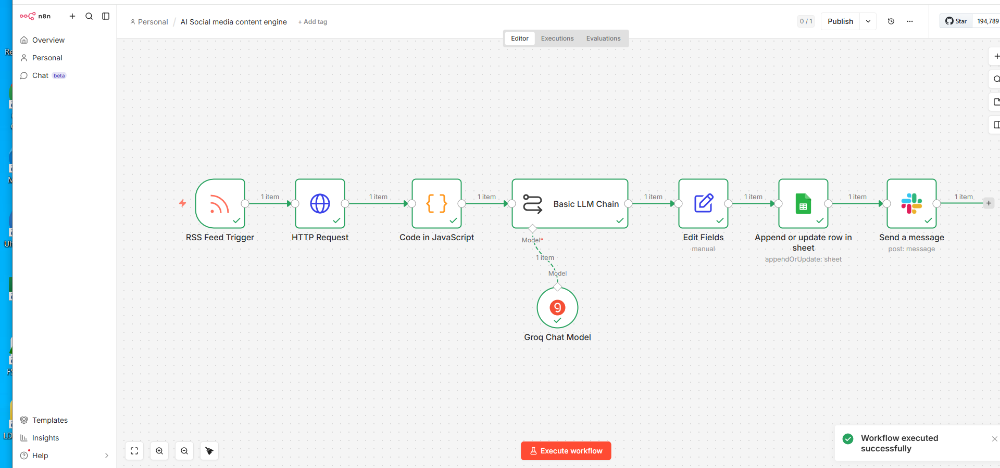

# 📊 Daily Sales Reporting Automation

An automated reporting workflow built with **n8n** that retrieves sales data from Google Sheets, processes key business metrics using JavaScript, and delivers a professional sales summary via Gmail.

---

## 📌 Overview

Many businesses spend valuable time manually collecting sales data, calculating daily metrics, and preparing reports for managers.

This workflow automates the reporting process, providing accurate sales summaries while reducing manual work and improving decision-making.

---

## 🚀 Business Problem

Sales teams often experience:

- Manual report preparation
- Time-consuming spreadsheet analysis
- Delayed business insights
- Human calculation errors
- Inconsistent reporting

---

## ✅ Solution

This workflow automatically:

1. Starts with a manual trigger.
2. Retrieves sales records from Google Sheets.
3. Uses JavaScript to calculate key sales metrics.
4. Generates a sales summary.
5. Sends the report automatically through Gmail.

---

## 🛠 Technologies Used

- n8n
- Manual Trigger
- Google Sheets
- JavaScript Code Node
- Gmail

---

## 🔄 Workflow Overview

```text
Manual Trigger
      │
      ▼
Google Sheets
      │
      ▼
JavaScript Processing
      │
      ▼
Generate Sales Summary
      │
      ▼
Send Report via Gmail
```

---

## 📷 Workflow Screenshot



---

## 💼 Business Value

- Eliminates manual report preparation
- Provides accurate daily sales insights
- Reduces reporting errors
- Improves management decision-making
- Saves valuable business time

---

## ✨ Key Features

- Automated sales reporting
- Google Sheets integration
- JavaScript data processing
- Email report delivery
- Fast business insights

---

## 🎯 Skills Demonstrated

- Workflow Automation
- JavaScript
- Data Processing
- Google Sheets Integration
- Gmail Integration
- Business Reporting
- n8n Development

---

## 📂 Repository Structure

```text
.
├── assets
│   ├── docs
│   └── screenshots
│       └── workflow-overview.png
├── workflow.json
└── README.md
```

---

## 🚀 Future Improvements

- Scheduled automatic execution
- Interactive dashboard
- PDF report generation
- Slack notifications
- Multi-recipient reporting
- Sales trend visualization

---

## 👨‍💻 Author

**Samuel Favour**

AI Automation Specialist

GitHub: https://github.com/SamFavour-Lab

---

### ⭐ If you found this project helpful, consider giving the repository a star.
